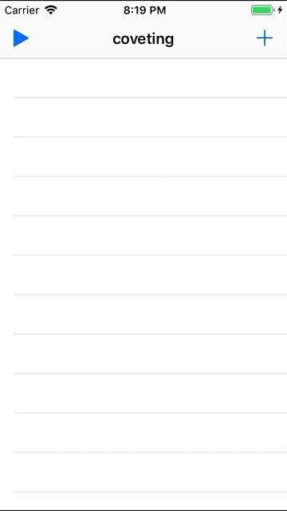

# Day 29 | [HWS 29](https://www.hackingwithswift.com/100/29) | [Index](https://github.com/JulesMoorhouse/100DaysOfSwift/blob/master/README.md)

- Folder: [P05X WordScrable](https://github.com/JulesMoorhouse/100DaysOfSwift/tree/master/P05X%20WordScrable/WordScrable) (based on P05 WordScrable aka Project 5)

- Challenge changes from the WordScrable project, refactoring and added UIAlertController etc.
  
