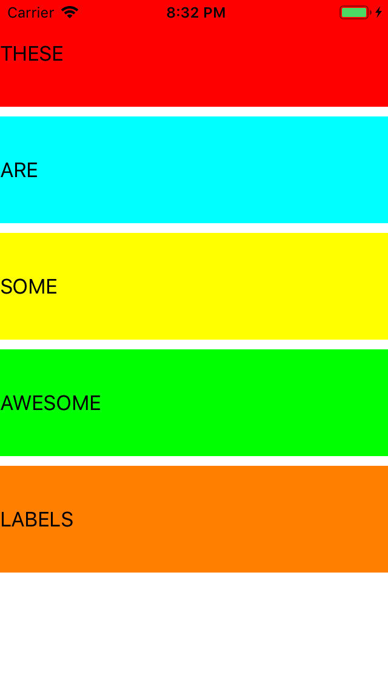

# Day 31 | [HWS 31](https://www.hackingwithswift.com/100/31) | [Index](https://github.com/JulesMoorhouse/100DaysOfSwift/blob/master/README.md)

- Folder: [P06B Autolayout](https://github.com/JulesMoorhouse/100DaysOfSwift/tree/master/P06B%20AutoLayout/P06B%20AutoLayout)

- Folder: [P06X AutoLayoutAnchors](https://github.com/JulesMoorhouse/100DaysOfSwift/tree/master/P06X%20AutoLayoutAnchors/P06B%20AutoLayout)

- Topics: advanced Visual Formatting Language and Auto Layout anchors.

- Challenge changes from the Autolayout project, added further anchors etc.

