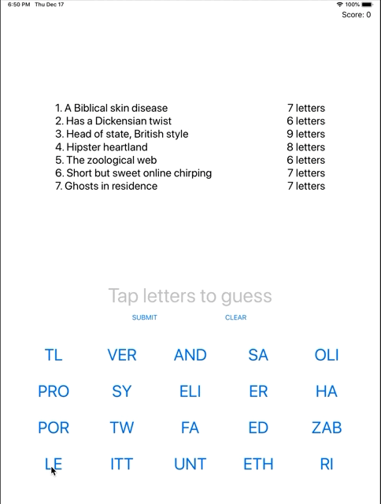
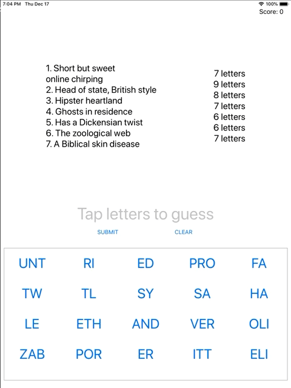

# Day 36 / 37 / 38

- Folder: [P08 SwiftyWords](https://github.com/JulesMoorhouse/100DaysOfSwift/tree/master/P08%20SwiftyWords/SwiftyWords)

- Folder: [P08X SwiftyWords](https://github.com/JulesMoorhouse/100DaysOfSwift/tree/master/P08X%20SwiftyWords/SwiftyWords) (based on P08 SwiftyWords aka Project 8)

- Topics:  Text alignment, layout margins, UIFont, addTarget, enumerated, joined, replacingOccurences and more.

- Challenge changes from P08 SwiftyWords, UI changes and game logic.

 

