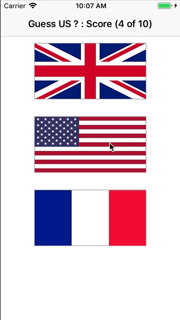

# Day 57 / 58 | [HWS 57](https://www.hackingwithswift.com/100/57) | [Index](https://github.com/JulesMoorhouse/100DaysOfSwift/blob/master/README.md)

- Topics: animate(withDuration:), CGAffineTransform, alpha, and more.

- Folder: [P15X GuessTheFlag](https://github.com/JulesMoorhouse/100DaysOfSwift/tree/master/P15X%20GuessTheFlag/GuessTheFlag) (based on P06A GuessTheFlag aka Project 2)

- Challenge changes, update older projects with animations

