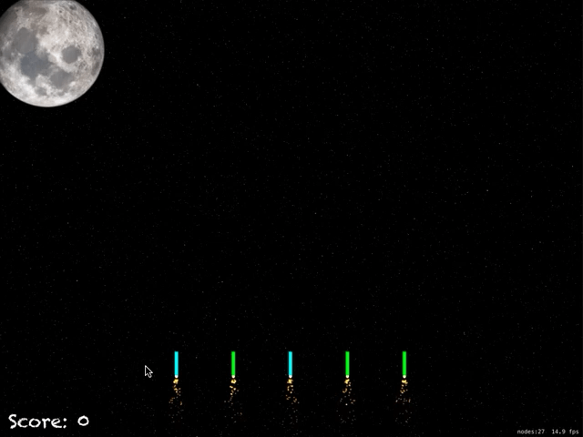

# Day 70 / 71 | [HWS 70](https://www.hackingwithswift.com/100/70) | [Index](https://github.com/JulesMoorhouse/100DaysOfSwift/blob/master/README.md)

- Topics: UIBezierPath, SKAction.follow(), for case let, and more.

- Folder: [P20 FireworksNight](https://github.com/JulesMoorhouse/100DaysOfSwift/tree/master/P20%20FireworksNight/FireworksNight)

- Challenge, added action sequence to remove sprite, added game over etc

