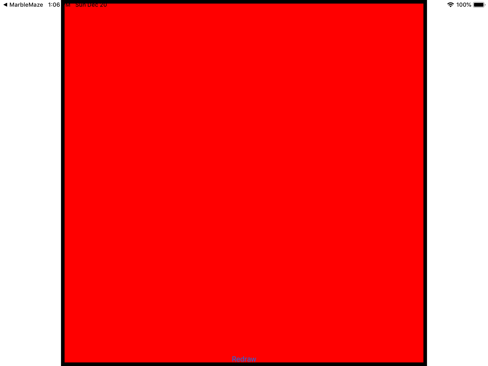

# Day 88 / 89

- Topics: UIGraphicsImageRenderer, drawing fills and strokes, and insetting a CGRect, while also getting more practice with NSAttributedString and more.

- Folder: [P27 CoreGraphics](https://github.com/JulesMoorhouse/100DaysOfSwift/tree/master/P27%20CoreGraphics/CoreGraphics)

