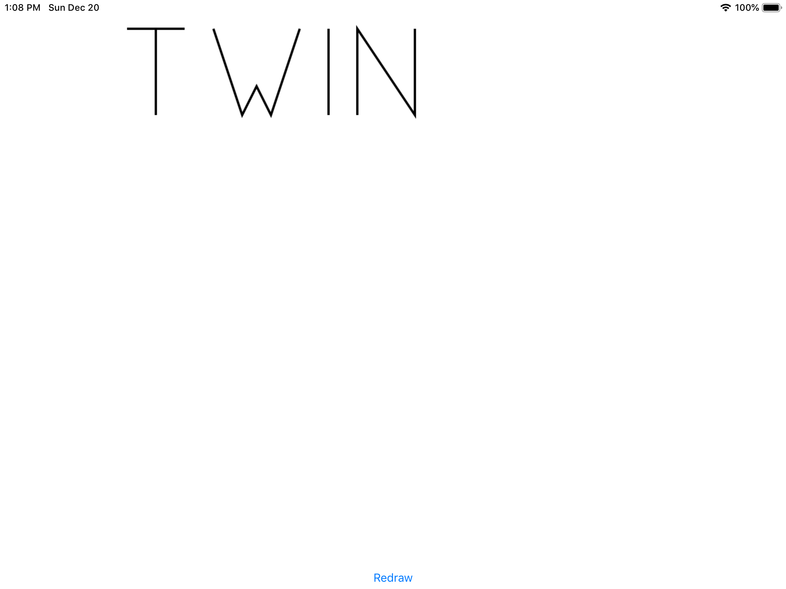

# Day 88 / 89 | [HWS 88](https://www.hackingwithswift.com/100/88) | [Index](https://github.com/JulesMoorhouse/100DaysOfSwift/blob/master/README.md)

- Topics: UIGraphicsImageRenderer, drawing fills and strokes, and insetting a CGRect, while also getting more practice with NSAttributedString and more.

- Folder: [P27X CoreGraphics](https://github.com/JulesMoorhouse/100DaysOfSwift/tree/master/P27X%20CoreGraphics/CoreGraphics) (based on P27 CoreGraphics) - emoji and word twin drawn.
- 

