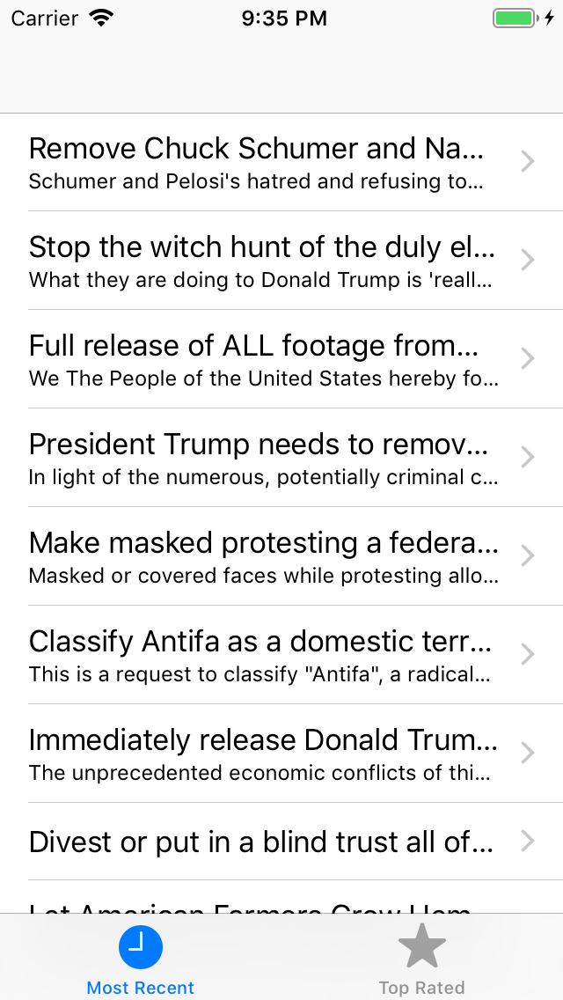
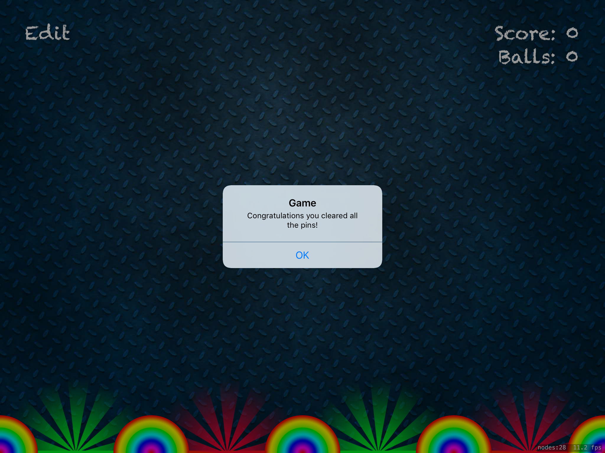
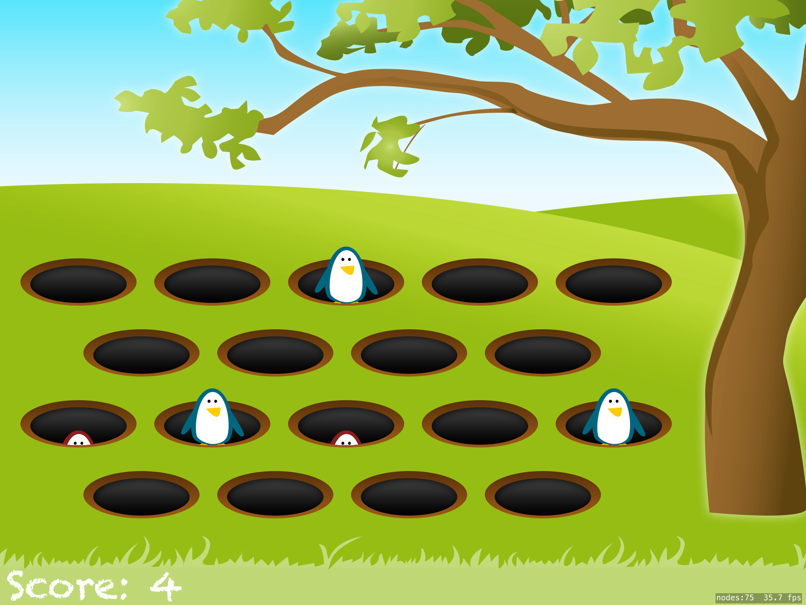
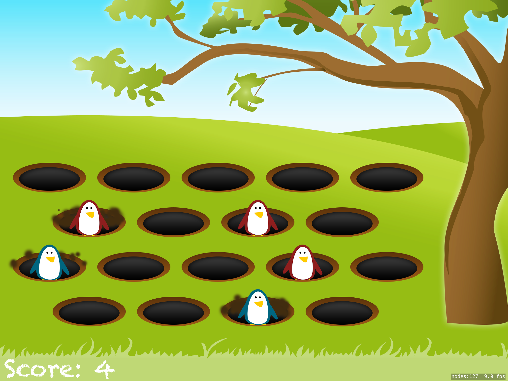
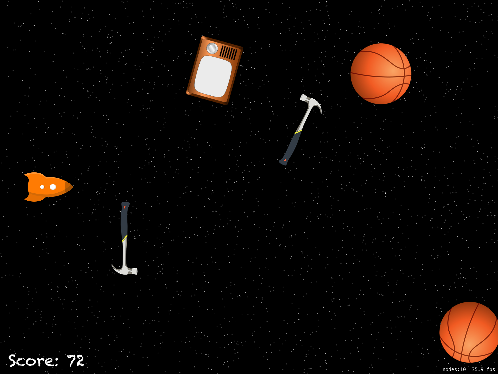
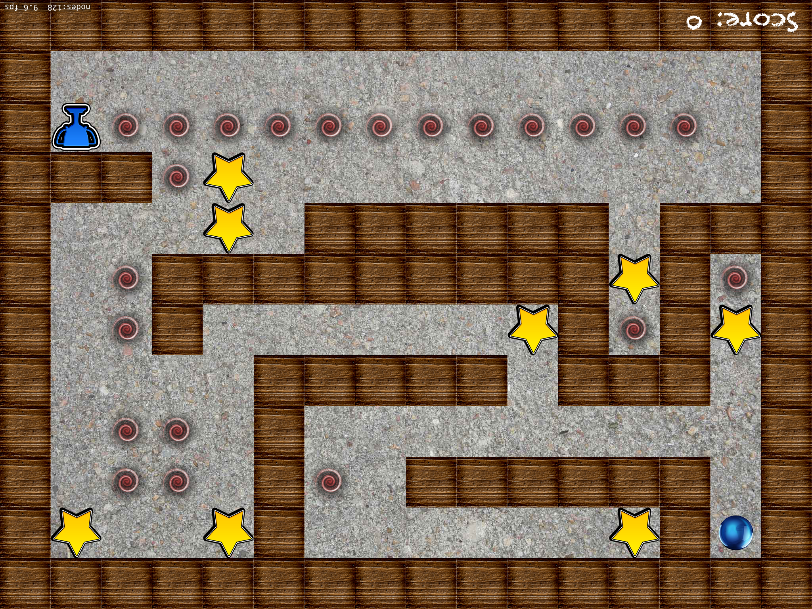
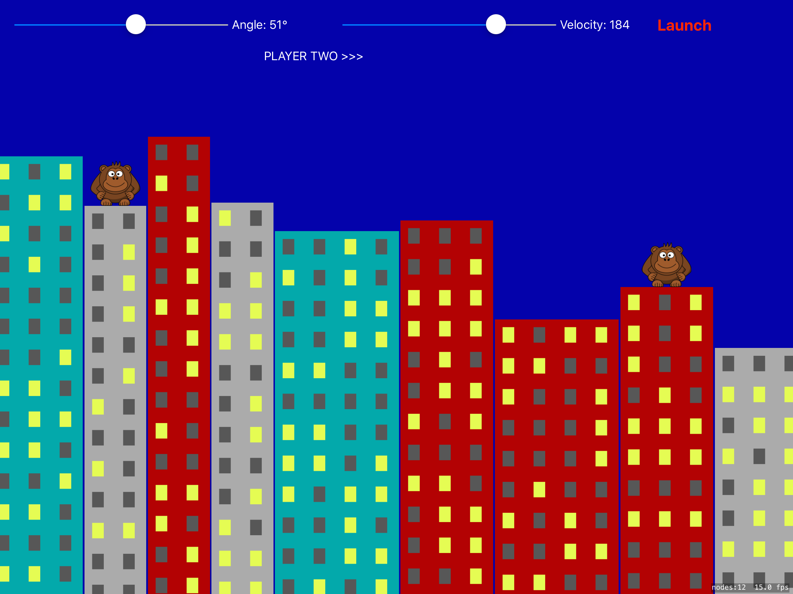

# 100DaysOfSwift

**Project Prefixes**
- Pnn - Project
- PnnX - Project with challenge changes
- PnnA - Project A
- Xnn - Full challenge project

|||
|-|-|
|**Day 16 / 17**  - Folder: [P01 StormViewer](https://github.com/JulesMoorhouse/100DaysOfSwift/tree/master/P01%20StormViewer/StormViewer)   - Topics: view controllers, storyboards, FileManager class, UIImageView, UIImage, UINavigationBar and more. |  |
|**Day 18**  - Folder: [P01X StormViewer](https://github.com/JulesMoorhouse/100DaysOfSwift/tree/master/P01X%20StormViewer/StormViewer)   - Challenge changes from the StormViewer project and interface builder updates, array sorting. |  |
|**Day 19 / 20**  - Folder: [P02 GuessTheFlag](https://github.com/JulesMoorhouse/100DaysOfSwift/tree/master/P02%20GuessTheFlag/GuessTheFlag)   - Topics: Asset catalogs, buttons, colors, array shuffling, random number generation, @IBAction and UIAlertController. |  |
|**Day 21**  - Folder: [P02X GuessTheFlag](https://github.com/JulesMoorhouse/100DaysOfSwift/tree/master/P02X%20GuessTheFlag/GuessTheFlag)   - Challenge changes from the GuessTheFlag project, simple UI changes and a new UIAlertController. |  |
|**Day 22**  - Folder: [P03 StormViewerActivity](https://github.com/JulesMoorhouse/100DaysOfSwift/tree/master/P03%20StormViewerActivity/StormViewer) (based on P01 StormViewer aka Project 1)  - Topics: UIBarButtonItem and UIActivityViewController. |  |
|**Day 23**  - Folder: [X01 WorldFlagsViewer](https://github.com/JulesMoorhouse/100DaysOfSwift/tree/master/X01%20WorldFlagsViewer/WorldFlagsViewer) - Milestone project challenge covering projects 1 to 3. |  |
|**Day 24 / 25**  - Folder: [P04 SimpleBrowser](https://github.com/JulesMoorhouse/100DaysOfSwift/tree/master/P04%20SimpleBrowser/SimpleBrowser) - Topics: WKWebView, action sheets, UIProgressView, key-value observing and more. |  |
|**Day 26**  - Folder: [P04X SimpleBrowser](https://github.com/JulesMoorhouse/100DaysOfSwift/tree/master/P04X%20SimpleBrowser/SimpleBrowser) (based on P04 SimpleBrowser aka Project 4) - Challenge changes from the SimpleBrowser project, webView navigation and add a UITableView as a new initial screen. |  |
|**Day 27 / 28**  - Folder: [P05 WordScrable](https://github.com/JulesMoorhouse/100DaysOfSwift/tree/master/P05%20WordScrable/WordScrable)  - Topics: capture lists and reading files. |  |
|**Day 29**  - Folder: [P05X WordScrable](https://github.com/JulesMoorhouse/100DaysOfSwift/tree/master/P05X%20WordScrable/WordScrable) (based on P05 WordScrable aka Project 5)  - Challenge changes from the WordScrable project, refactoring and added UIAlertController etc. |  |
|**Day 30**  - Folder: [P06A GuessTheFlag](https://github.com/JulesMoorhouse/100DaysOfSwift/tree/master/P06A%20GuessTheFlag/GuessTheFlag) (based on P02X GuessTheFlag aka Project 2)  - Topics: aspect ratio constraints, Visual Format language and more. |  |
|**Day 31**  - Folder: [P06B Autolayout](https://github.com/JulesMoorhouse/100DaysOfSwift/tree/master/P06B%20AutoLayout/P06B%20AutoLayout)  - Folder: [P06X AutoLayoutAnchors](https://github.com/JulesMoorhouse/100DaysOfSwift/tree/master/P06X%20AutoLayoutAnchors/P06B%20AutoLayout)  - Topics: advanced Visual Formatting Language and Auto Layout anchors.  - Challenge changes from the Autolayout project, added further anchors etc. |  |
|**Day 32**  - Folder: [X02 - Shopping List](https://github.com/JulesMoorhouse/100DaysOfSwift/tree/master/X02%20ShoppingList/ShoppingList)  - challenge project.  - Milestone project challenge |  |
|**Day 33 / 34 / 35**  - Folder: [P07 WhiteHousePetitions](https://github.com/JulesMoorhouse/100DaysOfSwift/tree/master/P07%20WhiteHousePetitions/P07%20WhiteHousePetitions)- Folder: [P07X WhiteHousePetitions](https://github.com/JulesMoorhouse/100DaysOfSwift/tree/master/P07X%20WhiteHousePetitions/P07%20WhiteHousePetitions) (based on P07 WhiteHousePetitions aka Project 7) - Topics: UITabBarController, Data, Codable, UITabBarController and UIStoryboard. - Challenge changes, add a new UIBarButtonItem + UIAlertController and filter results etc. |   |
|**Day 36 / 37 / 38**- Folder: [P08 SwiftyWords](https://github.com/JulesMoorhouse/100DaysOfSwift/tree/master/P08%20SwiftyWords/SwiftyWords) - Folder: [P08X SwiftyWords](https://github.com/JulesMoorhouse/100DaysOfSwift/tree/master/P08X%20SwiftyWords/SwiftyWords) (based on P08 SwiftyWords aka Project 8) - Topics:  Text alignment, layout margins, UIFont, addTarget, enumerated, joined, replacingOccurences and more. - Challenge changes from P08 SwiftyWords, UI changes and game logic. |   |
|**Day 39**  - Folder: [P09A WhiteHousePetitions](https://github.com/JulesMoorhouse/100DaysOfSwift/tree/master/P09A%20WhiteHousePetitions/P07%20WhiteHousePetitions) (based on P07X WhiteHousePetitions aka Project 7) - DispatchQueue.global - async, DispatchQueue.main.async - Folder: [P09B WhiteHousePetitions](https://github.com/JulesMoorhouse/100DaysOfSwift/tree/master/P09B%20WhiteHousePetitions/P07%20WhiteHousePetitions) (based on P07X WhiteHousePetitions aka Project 7) - PerformSelector - Topics: Grand Central Dispatch, quality of service queues, performSelector() and more. - An important video on GCD https://www.hackingwithswift.com/read/9/3/gcd-101-async | |
|**Day 40**  - Folder: [P09X StormViewer](https://github.com/JulesMoorhouse/100DaysOfSwift/tree/master/P09X%20StormViewer/StormViewer) (based on P01X StormViewer aka Project 1) - Folder: [P09X SwiftyWords](https://github.com/JulesMoorhouse/100DaysOfSwift/tree/master/P09X%20SwiftyWords/SwiftyWords) (based on P08X SwiftyWords aka Project 8) - Folder: [P09X WhiteHousePetitions](https://github.com/JulesMoorhouse/100DaysOfSwift/tree/master/P09X%20WhiteHousePetitions/P07%20WhiteHousePetitions) (based on P0X WhiteHousePetitions) - Challenge GCD changes to several projects. | |
|**Day 41**  - Folder: [X03 Hangman](https://github.com/JulesMoorhouse/100DaysOfSwift/tree/master/X03%20Hangman/Hangman) - Milestone project challenge for Projects 7 to 9 |  |
|**Day 42 / 43 / 44**  - Folder: [P10 NamesToFaces](https://github.com/JulesMoorhouse/100DaysOfSwift/tree/master/P10%20NamesToFaces/NamesToFaces) - Folder: [P10X NamesTofaces](https://github.com/JulesMoorhouse/100DaysOfSwift/tree/master/P10X%20NamesToFaces/NamesToFaces) (based on P10 NamesToFaces  aka Project 10) - Topics: UICollectionView and UICollectionViewCell, UIImagePickerController, UUID, NSObject subclasses, and fatalError |    |
|**Day 45 / 46 / 47**  - Folder: [P11 Pachinko](https://github.com/JulesMoorhouse/100DaysOfSwift/tree/master/P11%20Pachinko/Pachinko) - Folder: [P11X Pachinko](https://github.com/JulesMoorhouse/100DaysOfSwift/tree/master/P11X%20Pachinko/Pachinko) (based on P11 Pachinko  aka Project 11) - Topics: SpiteKit, SKSpriteNode and SKPhysicsBody - Challenge changes, use new images, position changes and game logic changes. |   |
|**Day 48 / 49**  - Folder: [P12 UserDefaults](https://github.com/JulesMoorhouse/100DaysOfSwift/tree/master/P12%20UserDefaults/UserDefaults) - test project just showing some methods. - Folder: [P12A NamesToFaces NSCoding](https://github.com/JulesMoorhouse/100DaysOfSwift/tree/master/P12A%20NamesToFaces%20NSCoding/NamesToFaces) (based on P10X NamesTofaces aka Project 10) - Folder: [P12B NamesToFaces Codable](https://github.com/JulesMoorhouse/100DaysOfSwift/tree/master/P12B%20NamesToFaces%20Codable)  (based on P10X NamesTofaces  aka Project 10) - Folder: [P12X StormViewer](https://github.com/JulesMoorhouse/100DaysOfSwift/tree/master/P12X%20StormViewer/StormViewer) (based on P09X StormViewer aka Project 1) - Folder: [P12X GuessTheFlag](https://github.com/JulesMoorhouse/100DaysOfSwift/tree/master/P12X%20GuessTheFlag/GuessTheFlag) (based on P06A GuessTheFlag aka Project 2) - Folder: [P12X WordScrable](https://github.com/JulesMoorhouse/100DaysOfSwift/tree/master/P12X%20WordScrable/WordScrable) (based on P05X WordScrable aka Project 5) - Topics: UserDefaults, NSCoding (Objective C compatible), Codable (Not Objective C compatible), NSKeyedArchiver, NSKeyedUnarchiver, JSONEncoder and JSONDecoder - Challenge changes, update older projects and add UserDefaults | |
|**Day 50**  - Folder: [X04 CameraCaptions](https://github.com/JulesMoorhouse/100DaysOfSwift/tree/master/X04%20CameraCaptions/CameraCaptions) - Milestone project challenge projects 10 to 12 |  |
|**Day 51**  - Watching a couple of conference videos - https://www.youtube.com/watch?v=OgU8d_E1K14 - https://vimeo.com/291590798 | |
|**Day 52 / 53 / 54**  - Topics: UISlider while also getting some practice with UIImagePickerController and saving to iOS Photos. - Folder: [P13 InstaFilter](https://github.com/JulesMoorhouse/100DaysOfSwift/tree/master/P13%20InstaFilter/InstaFilter) - Folder: [P13X InstaFilter](https://github.com/JulesMoorhouse/100DaysOfSwift/tree/master/P13X%20InstaFilter/InstaFilter) (based on P13 InstaFilter aka Project 13) - Challenge changes from P13 InstaFilter, additional slider for filter property and UI changes. |   |
|**Day 55 / 56**  - Topics: SKCropNode, SKTexture, and more.- Folder: [P14 Whack-A-Penguin](https://github.com/JulesMoorhouse/100DaysOfSwift/tree/master/P14%20WhackAPenguin/WhackAPenguin) - Folder: [P14X Whack-A-Penguin](https://github.com/JulesMoorhouse/100DaysOfSwift/tree/master/P14X%20WhackAPenguin/WhackAPenguin) (based on P14 Whack-A-Penguin aka Project 14) - Challenge changes from P14X Whack-A-Penguin, created a game over sound file, additional SKLabelNode and new SKEmitterNode for mud. |   |
|**Day 57 / 58**  - Topics: animate(withDuration:), CGAffineTransform, alpha, and more. - Folder: [P15 Animation](https://github.com/JulesMoorhouse/100DaysOfSwift/tree/master/P15%20Animation/Animation) - Folder: [P15X SwiftyWords](https://github.com/JulesMoorhouse/100DaysOfSwift/tree/master/P15X%20SwiftyWords/SwiftyWords) (based on P09X SwiftyWords - aka Project 8) - Folder: [P15X InstaFilter](https://github.com/JulesMoorhouse/100DaysOfSwift/tree/master/P15X%20InstaFilter/InstaFilter) (based on P13X InstaFilter aka Project 13) - Folder: [P15X GuessTheFlag](https://github.com/JulesMoorhouse/100DaysOfSwift/tree/master/P15X%20GuessTheFlag/GuessTheFlag) (based on P06A GuessTheFlag aka Project 2) - Challenge changes, update older projects with animations |     |
|**Day 59**  - Folder: [X05 CountryFacts](https://github.com/JulesMoorhouse/100DaysOfSwift/tree/master/X05%20CountryFacts/CountryFacts) - Milestone project challenge 13 to 15 |  |
|**Day 60 / 61**  - Topics: MKMapView, MKAnnotation, MKPinAnnotationView, CLLocationCoordinate2D, and more. - Folder: [P16 CapitalCities](https://github.com/JulesMoorhouse/100DaysOfSwift/tree/master/P16%20CapitalCities/CapitalCities) - Folder: [P16X CapitalCities](https://github.com/JulesMoorhouse/100DaysOfSwift/tree/master/P16X%20CapitalCities/CapitalCities) (based on P16 CapitalCities) - Challenge changes, add webview for wiki details shown via annotationView |  |
|**Day 62 / 63**  - Topics: Pixel-perfect collision detection, advancing particle systems, Timer, linear and angular Damping, and more. - Folder: [P17 Space Race](https://github.com/JulesMoorhouse/100DaysOfSwift/tree/master/P17%20SpaceRace/SpaceRace) - Folder: [P17X Space Race](https://github.com/JulesMoorhouse/100DaysOfSwift/tree/master/P17X%20SpaceRace/SpaceRace) (based on P17 Space Race) - Challenge changes, added game restrictions and difficulty. |  |
|**Day 64 / 65**  - Folder: [P18 Debugging](https://github.com/JulesMoorhouse/100DaysOfSwift/tree/master/P18%20Debugging/Debugging) - Topics: Print, assert, breakpoints and view debugging. - Challenge, debugging and changing values of older projects (didn't commit) | |
|**Day 66**  - Folder: [X06 ShootingGallery](https://github.com/JulesMoorhouse/100DaysOfSwift/tree/master/X06%20ShootingGallery/ShootingGallery) - Milestone project challenge projects 16 to 18 |  |
|**Day 67 / 68 / 69**  - Topics: NSExtensionItem - creating a safari extension which runs JavaScript on a web page. - Folder: [P19 SafariJavascriptInjection](https://github.com/JulesMoorhouse/100DaysOfSwift/tree/master/P19%20SafariJavascriptInjection/SafariJavascriptInjection) - Folder: [P19X SafariJavascriptInjection](https://github.com/JulesMoorhouse/100DaysOfSwift/tree/master/P19X%20SafariJavascriptInjection/SafariJavascriptInjection) (based on P19 SafariJavascriptInjection) - Challenge changes, add a table view to list scripts and use UserDefaults to store them, tap to run, disclosure to edit. | |
|**Day 70 / 71**  - Topics: UIBezierPath, SKAction.follow(), for case let, and more. - Folder: [P20 FireworksNight](https://github.com/JulesMoorhouse/100DaysOfSwift/tree/master/P20%20FireworksNight/FireworksNight) - Folder: [P20X FireworksNight](https://github.com/JulesMoorhouse/100DaysOfSwift/tree/master/P20X%20FireworksNight/FireworksNight) (based on P20 FireworksNight) - Challenge, added action sequence to remove sprite, added game over etc |  |
|**Day 72 / 73**  - Topics: UNUserNotificationCenter - Folder: [P21 LocalNotifications](https://github.com/JulesMoorhouse/100DaysOfSwift/tree/master/P21%20LocalNotifications/LocalNotifications) - Folder: [P21X GuessTheFlag](https://github.com/JulesMoorhouse/100DaysOfSwift/tree/master/P21X%20GuessTheFlag/GuessTheFlag) (based on P15X GuessTheFlag) - Challenge changes, update projects to update or add user notifications |  |
|**Day 74**  - Folder: [X07 Notes](https://github.com/JulesMoorhouse/100DaysOfSwift/tree/master/X07%20Notes/Notes) - Milestone project challenge 19 to 21 |  |
|**Day 75 / 76**  - Topics: Core Location, CLBeaconRegion, and more. - Folder: [P22 DetectABeacon](https://github.com/JulesMoorhouse/100DaysOfSwift/tree/master/P22%20DetectABeacon/DetectABeacon) - Folder: [P22X DetectABeacon](https://github.com/JulesMoorhouse/100DaysOfSwift/tree/master/P22X%20DetectABeacon/DetectABeacon) (based on P22 DetectABeacon) - Challenge, aded further beacons and a circle for range | |
|**Day 77 / 78 / 79**  - Topics: SKShapeNode, touchesEnded(), AVAudioPlayer, CaseIterable, removeFirst() and more. - Folder: [P23 SwiftyNinja](https://github.com/JulesMoorhouse/100DaysOfSwift/tree/master/P23%20SwiftyNinja/SwiftyNinja) - Folder: [P23X SwiftyNinja](https://github.com/JulesMoorhouse/100DaysOfSwift/tree/master/P23X%20SwiftyNinja/SwiftyNinja) (based on P23 SwiftyNinja) - Challenge, add game over, moved numbers, strings into enums and constants etc |  |
|**Day 80 /81**  - Topics: String subscripts, contains(where:), NSAttributedString, and more. - File: 24 SwiftStrings.playground - File: P24X SwiftStrings.playground - Challenge to write from string extensions | |
|**Day 82**  - Milestone project challenge 22 to 24 - File: X08 Extensions playground | |
|**Day 83 / 84**  - Topics: Peer to peer networking, while also getting some practice with collection views, GCD, and more. - Folder: [P25 SelfieShare](https://github.com/JulesMoorhouse/100DaysOfSwift/tree/master/P25%20SelfieShare/SelfieShare) - Folder: [P25X SelfieShare](https://github.com/JulesMoorhouse/100DaysOfSwift/tree/master/P25X%20SelfieShare/SelfieShare) (based on P25 SelfieShare) - Challenge to add some UIAlerts for status, also send text messages and produce a list of users |  |
|**Day 85 / 86 / 87**  - Topics: Core Motion, accelerometer, how to load a game level from a file and how to create custom physics bitmasks, while also getting some practice with fatalError(), SKAction, and more. - Folder: [P26 MarbleMaze](https://github.com/JulesMoorhouse/100DaysOfSwift/tree/master/P26%20MarbleMaze/MarbleMaze) - Folder: [P26X MarbleMaze](https://github.com/JulesMoorhouse/100DaysOfSwift/tree/master/P26X%20MarbleMaze/MarbleMaze) (based on P26 MarbleMaze) |   |
|**Day 88 / 89**  - Topics: UIGraphicsImageRenderer, drawing fills and strokes, and insetting a CGRect, while also getting more practice with NSAttributedString and more. - Folder: [P27 CoreGraphics](https://github.com/JulesMoorhouse/100DaysOfSwift/tree/master/P27%20CoreGraphics/CoreGraphics) - Folder: [P27X CoreGraphics](https://github.com/JulesMoorhouse/100DaysOfSwift/tree/master/P27X%20CoreGraphics/CoreGraphics) (based on P27 CoreGraphics) - emoji and word twin drawn. - Folder: [P27X StormViewer](https://github.com/JulesMoorhouse/100DaysOfSwift/tree/master/P27X%20StormViewer/StormViewer) (based on P12X StormViewer aka Project 1) - draw text on image. |   |
|**Day 90**  - Milestone project challenge 25 to 27 - Folder: [X09 MemeGenerator](https://github.com/JulesMoorhouse/100DaysOfSwift/tree/master/X09%20MemeGenerator/MemeGenerator) |  |
|**Day 91**  - Topics: Core Graphics Redux - File: Learn-Core-Graphics.playground | |
|**Day 92 / 93**  - Topics: LocalAuthentication framework and the iOS keychain, get some practice with UITextView and more. - Folder: [P28 SecretSwift](https://github.com/JulesMoorhouse/100DaysOfSwift/tree/master/P28%20SecretSwift/SecretSwift) - Folder: [P28X SecretSwift](https://github.com/JulesMoorhouse/100DaysOfSwift/tree/master/P28X%20SecretSwift/SecretSwift) (based on P28 SecretSwift) - Folder: [P28X NamesToFaces Codable](https://github.com/JulesMoorhouse/100DaysOfSwift/tree/master/P28X%20NamesToFaces%20Codable/NamesToFaces) (based on P12B NamesToFaces Codable) - Challenge: P28X SecretSwift + P28X NamesToFaces Codable - Add a unlock / done button, add a simple password fallback feature | |
|**Day 94 / 95 / 96**  - Topics: How to generate a scene dynamically, how to connect SpriteKit and UIKit, and more. - Folder: [P29 ExplodingMonkeys](https://github.com/JulesMoorhouse/100DaysOfSwift/tree/master/P29%20ExplodingMonkeys/ExplodingMonkeys) - Folder: [P29X ExplodingMonkeys](https://github.com/JulesMoorhouse/100DaysOfSwift/tree/master/P29X%20ExplodingMonkeys/ExplodingMonkeys) (based on P29 ExplodingMonkeys) - Challenge to add wind and auto layout, scores and wind with increased difficulty (gravity / speed) |  |
|**Day 97 / 98**  - Topics: Time Profiler and Allocations instruments, how to draw shadows in both Core Graphics and CALayer, re-using table view cells in code, and more. - Folder: [P30 XcodeInstruments](https://github.com/JulesMoorhouse/100DaysOfSwift/tree/master/P30%20XcodeInstruments/Project30) - Folder: [P30X XcodeInstruments](https://github.com/JulesMoorhouse/100DaysOfSwift/tree/master/P30X%20XcodeInstruments/Project30) (based on P30 XcodeInstruments) - remove all force unwraps - Folder: [P30X2 XcodeInstruments](https://github.com/JulesMoorhouse/100DaysOfSwift/tree/master/P30X2%20XcodeInstruments/Project30) (based on P30X XcodeInstruments) - do all images processing at the start | |
|**Day 99**  - Milestone project challenge 28 to 30 - Folder: [X10 Pelmanism](https://github.com/JulesMoorhouse/100DaysOfSwift/tree/master/X10%20Pelmanism/Pelmanism) |  |